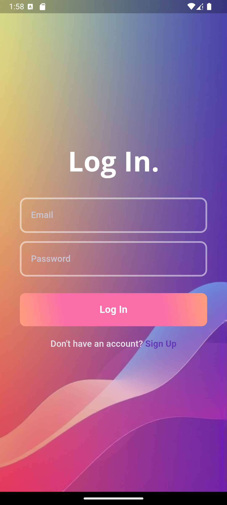

<h1 align="center" id="title">Login Page UI</h1>

Using Clean Architecture with BLoC

Fully Functionality Log In, Sign Up Page. Animated UI. Using Clean Architecture and BLoC. Remote Data Base with supabase.

  
  
  
<h2>🧐 Features</h2>

Here're some of the project's best features:

*   Sign Up
*   Log In
*   Password Reset

  
  
<h2>💻 Built with</h2>

Technologies used in the project:

*   Clean Architecture
*   BLoC
*   supabase - Remote Data Source
*   Animated UI